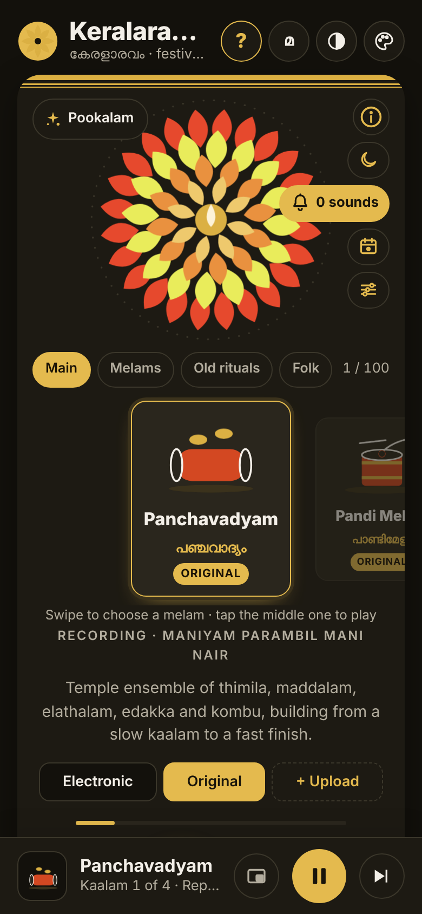
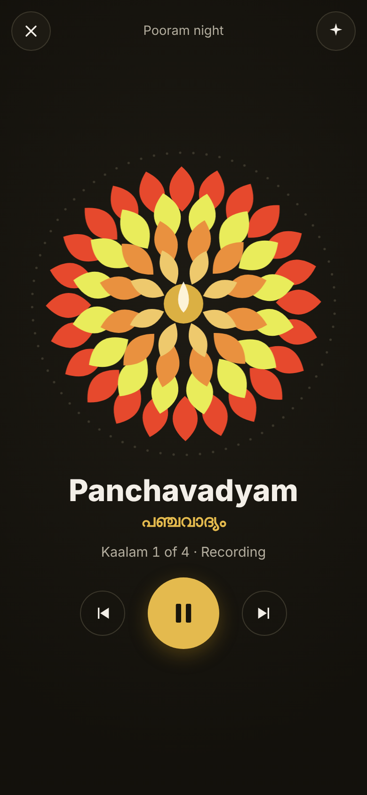
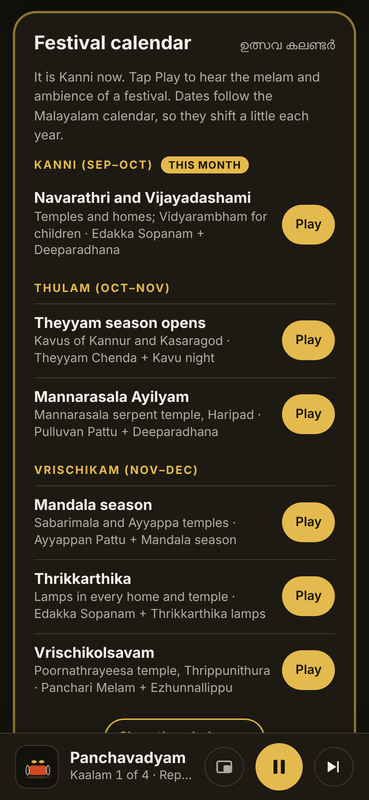
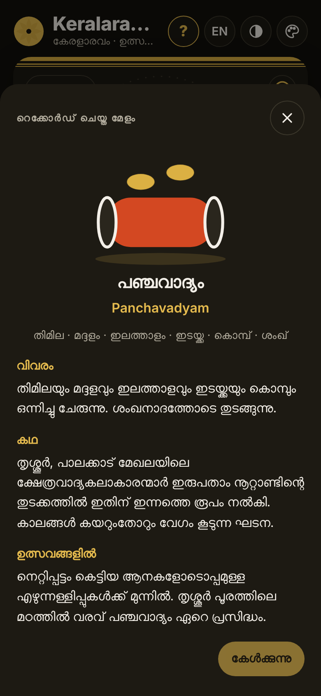
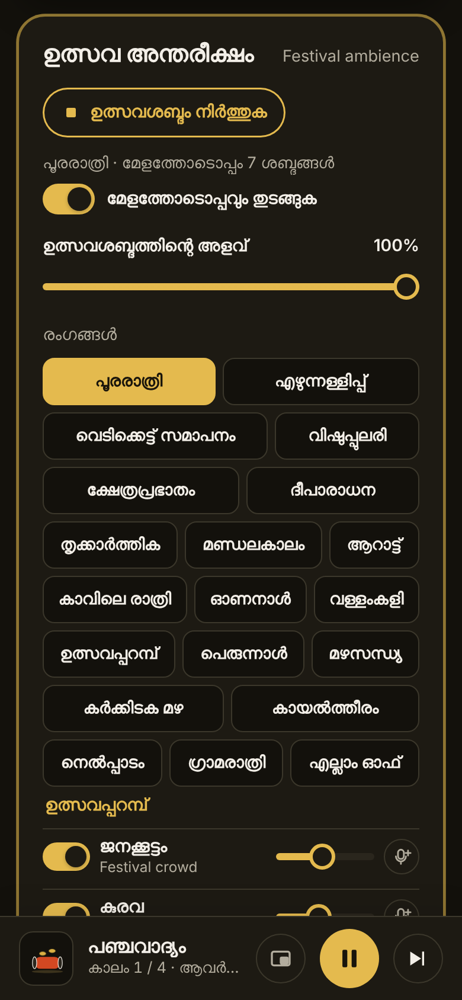

# Keralaravam · കേരളാരവം

**Kerala festival sounds in your pocket.** Keralaravam is a free web app (PWA) for the sound of a Kerala festival: Panchavadyam, Pandi and Panchari Melam, Thayambaka and 100 melams and temple arts in all, with festival ambience, a Malayalam-calendar festival guide, practice tools and a sleep timer. It works offline once installed, in English and Malayalam.

> കേരളത്തിലെ ഉത്സവത്തിന്റെ ശബ്ദം നിങ്ങളുടെ ഫോണിൽ: പഞ്ചവാദ്യം, പാണ്ടി-പഞ്ചാരി മേളങ്ങൾ, തായമ്പക തുടങ്ങി 100 മേളങ്ങളും ക്ഷേത്രകലകളും, ഉത്സവ അന്തരീക്ഷവും ഉത്സവ കലണ്ടറും.

**Live app:** `https://YOUR-USERNAME.github.io/keralaravam/` (replace after you switch on GitHub Pages, see below)

<table>
  <tr>
    <td></td>
    <td></td>
    <td></td>
    <td></td>
    <td></td>
  </tr>
  <tr>
    <td align="center">Player</td><td align="center">Festival screen</td><td align="center">Festival calendar</td><td align="center">മലയാളം</td><td align="center">Ambience</td>
  </tr>
</table>

## Features

**Melams**
- 100 melams and temple arts in groups: Main, Melams, Old rituals, Folk, Stage arts, Onam, Very old arts and Utsavam moments.
- Nine play real recordings split into four kaalams (slow to fast): Panchavadyam, Pandi Melam, Panchari Melam, Thayambaka, Keli, Chempada, Adantha, Anchadantha and Edakka Sopanam. The rest play an electronic version until you add a recording.
- Swipe carousel with animated icons, ★ favourites, and an ⓘ page for every melam (About, Story, At festivals) in English and Malayalam.
- Kaalam build, hold one kaalam, "Repeat this kaalam", festival playlist, tempo and per-instrument mix.

**Your own recordings**
- Upload a file or record live. The app analyses the whole melam, finds four kaalams, cuts seamless loops, evens the volume and compresses to MP3, all on the phone.
- Save as Original (replacing the built-in recording) or as My upload.

**Festival ambience**
- 21 sounds generated in the app (crowd, temple bells, conch, chengila, vedikkettu, amittu, elephants, kurava, rain, frogs, palm breeze, temple pond…) and 19 one-tap scenes such as Pooram night, Vishu morning and Deeparadhana.
- Play ambience on its own or with a melam, and swap any sound for a real recording.

**More**
- Festival calendar by Malayalam month, with one-tap play of each festival's melam and ambience.
- Practice: slow a recorded kaalam to 50–90% without changing its pitch; click track and big beat counter for electronic melams.
- Sleep routine with gentle fade-out, wake-up with Temple dawn.
- My mixes, the Festival screen (full screen, for a TV or function), nine visualiser animations, six colour skins, light and dark themes.
- Lock-screen controls, a floating mini window and "Try next" suggestions.
- Backup and restore of uploads, mixes and settings to a .zip file.
- Built-in "How to use" guide (the ? button) and About page (tap the logo).

## Open Online

`https://soorajacontec.github.io/-Keralaravam/`


## Install on a phone

- **Android (Chrome):** open the site, then tap **Install** in the app's top bar or use the browser menu **⋮ → Install app**.
- **iPhone (Safari):** tap **Share → Add to Home Screen**.

Once installed, the app opens from the home screen and works without internet. Live recording and the wake-up alarm work best in the installed app.

## Run it on your computer

```bash
python3 -m http.server 8000
```

Then open http://localhost:8000. A local server is needed because the service worker and audio files don't load from `file://`.

## Project structure

```
index.html             the whole app (HTML, CSS and JS in one file)
manifest.webmanifest   PWA manifest (name, icons, colours)
sw.js                  service worker: offline cache
audio/                 built-in recordings, each kaalam a beat-matched loop (MP3)
icons/                 app icons (192, 512, maskable, Apple touch, favicon)
vendor/lame.min.js     lamejs MP3 encoder, used to compress uploads on the phone
docs/screenshots/      images used in this README
dev/                   editable source and build script
  app.html             source of index.html
  head.html            the <head> tags added for the installable version
  loops.json           loop points of the built-in recordings
  info.py              melam info texts (English and Malayalam), for reference
  build.py             rebuilds index.html from app.html
.nojekyll              tells GitHub Pages to serve files exactly as they are
```

## Making changes

1. Edit `dev/app.html`.
2. Run `python3 dev/build.py` from the repository root to rebuild `index.html`.
3. Open `sw.js` and bump the cache name, for example `keralaravam-v49` → `keralaravam-v50`. Without this, phones that already installed the app keep the old version.
4. Commit and push. GitHub Pages updates within a few minutes.

To add or replace a built-in recording, put the MP3 in `audio/`, add its loop start and length to `dev/loops.json`, list it in `RECDEF` inside `dev/app.html`, and add the file to the `SHELL` list in `sw.js`.

## Credits

- **Created by Sooraj Mavelikkara** · soorajmavelikkara@gmail.com
- **Recordings:** Panchavadyam by Maniyam Parambil Mani Nair; Panchari Melam and Chempada Melam by Cheranellur Sankarankutty Marar; Pandi Melam by Pariyanampatta Melam 2024; Keli by Young Mahadev Raja Parakatav & Team; Edakka Sopanam: "Minnum Ponnin Chilambum"; Thayambaka, Adantha and Anchadantha from single performances. All recordings remain the property of their artists and rights holders.
- **lamejs** MP3 encoder (LGPL), see `vendor/lamejs-LICENSE`.
- Festival ambience, electronic versions, animations and icons are made in the app.

## License

No license has been chosen yet. Until a `LICENSE` file is added, the code is "all rights reserved" by default. If you want others to reuse the code, add a license such as MIT from GitHub's **Add file → Create new file → LICENSE → Choose a license template**. Such a license would cover the code only, not the recordings in `audio/`.
